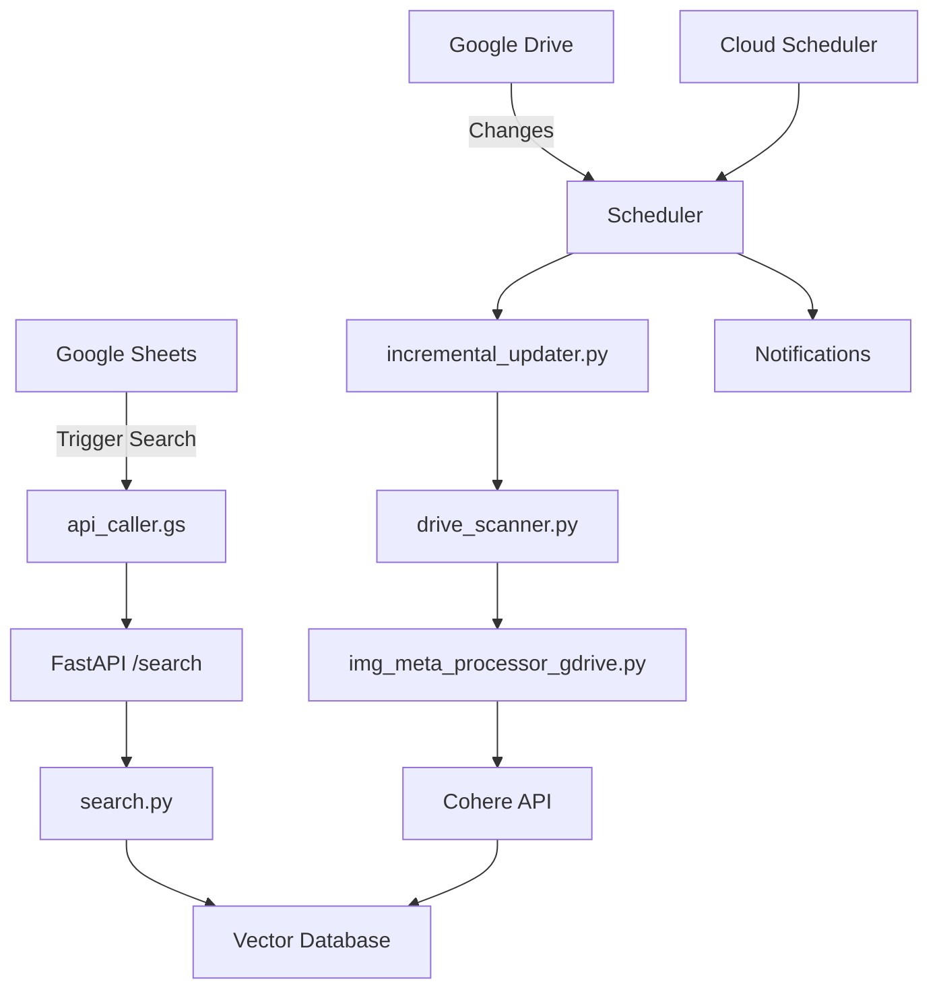

# 🏗️ Cohere RAG Image Search System - Project Structure

This document describes the reorganized project structure for better maintainability and clarity.

## 📁 Directory Structure

```
cohere-rag/
├── 📂 api/                     # FastAPI Web API
│   ├── main.py                # Main FastAPI application
│   ├── search.py              # Image search functionality
│   └── __init__.py            # Package initialization
│
├── 📂 vectorization/          # Image processing & embedding generation
│   ├── drive_scanner.py       # Google Drive file discovery
│   ├── img_meta_processor_gdrive.py  # Image processing & vectorization
│   ├── incremental_updater.py # Incremental updates for embeddings
│   └── __init__.py            # Package initialization
│
├── 📂 scheduler/              # Automated scheduling & batch processing
│   ├── scheduler.py           # Main scheduler with notifications
│   ├── batch_incremental_updater.py  # Batch processing for multiple companies
│   └── __init__.py            # Package initialization
│
├── 📂 gas/                    # Google Apps Script integration
│   └── api_caller.gs          # Google Sheets integration script
│
├── 📂 tests/                  # Test scripts and utilities
│   ├── test_exclusion.py      # Exclusion list functionality tests
│   ├── count_img.py           # Image counting utilities
│   └── __init__.py            # Package initialization
│
├── 📂 config/                 # Configuration files
│   ├── *.json                 # Service account keys & config files
│   └── embedding_*.json       # Sample embedding files
│
├── 📂 docs/                   # Documentation
│   ├── setup_scheduler.md     # Scheduler setup guide
│   ├── fix_cloud_build_trigger.md  # Cloud Build troubleshooting
│   └── PROJECT_STRUCTURE.md   # This file
│
├── 📂 deployment/             # Deployment configurations
│   ├── cloudbuild.yaml        # Main Cloud Build config
│   ├── cloudbuild-scheduler.yaml  # Scheduler Cloud Build config
│   └── scheduler-job.yaml     # Cloud Run Job configuration
│
├── 📂 docker/                 # Docker configurations
│   ├── Dockerfile             # Main API container
│   ├── Dockerfile.scheduler   # Scheduler container
│   └── Dockerfile.job         # Vectorization job container
│
├── 🐍 main.py                 # Project entry point
├── 📄 requirements.txt        # Python dependencies
├── 📄 README.md              # Main project documentation
├── 📄 Dockerfile             # Main Docker configuration
└── 🔧 .env                   # Environment variables (not in repo)
```

## 🚀 Usage

### Starting the system

```bash
# Start FastAPI server (default)
python main.py

# Start specific module
python main.py --module api         # Web API server
python main.py --module vectorization  # Vectorization processing
python main.py --module scheduler     # Automated scheduler
```

### Using individual modules

```bash
# Vectorization
cd vectorization/
python img_meta_processor_gdrive.py  # Full vectorization
python incremental_updater.py --uuid "..." --drive-url "..."  # Incremental update

# Scheduler
cd scheduler/
python scheduler.py --mode update    # Run scheduled update
python batch_incremental_updater.py --spreadsheet-id "..."  # Batch update

# API (development)
cd api/
uvicorn main:app --reload
```

## 📦 Module Descriptions

### 🌐 API Module (`api/`)

**Purpose**: Web API for image search functionality

- **main.py**: FastAPI application with REST endpoints
  - `/search` (POST): Image search with exclusion lists
  - `/incremental-update` (POST): Trigger incremental updates
  - `/batch-incremental-update` (POST): Trigger batch updates
  - `/health` (GET): System health check

- **search.py**: Core image search logic
  - Similarity search using cosine similarity
  - Random image search
  - Exclusion list filtering

### 🧠 Vectorization Module (`vectorization/`)

**Purpose**: Image processing and embedding generation

- **drive_scanner.py**: Google Drive integration
  - Recursive folder scanning
  - File metadata extraction
  - Image file filtering

- **img_meta_processor_gdrive.py**: Image processing pipeline
  - Image download and resizing
  - Cohere API embedding generation
  - GCS storage management

- **incremental_updater.py**: Efficient update system
  - Change detection (modification time, size)
  - Differential processing
  - Backup and rollback

### ⏰ Scheduler Module (`scheduler/`)

**Purpose**: Automated execution and batch processing

- **scheduler.py**: Main scheduling system
  - Cloud Scheduler integration
  - Email and Slack notifications
  - Health monitoring

- **batch_incremental_updater.py**: Multi-company processing
  - Parallel processing
  - Google Sheets integration
  - Comprehensive reporting

### 📱 GAS Module (`gas/`)

**Purpose**: Google Sheets integration

- **api_caller.gs**: Google Apps Script
  - Custom menu creation
  - Automatic search triggering
  - Exclusion list management
  - UUID generation

## 🔄 Data Flow



## 🛠️ Development Guidelines

### Adding New Features

1. **API Features**: Add to `api/` module
2. **Processing Features**: Add to `vectorization/` module  
3. **Automation Features**: Add to `scheduler/` module
4. **UI Features**: Modify `gas/api_caller.gs`

### Import Conventions

- **Within module**: Use relative imports (`.module`)
- **Cross-module**: Use absolute imports (`module.submodule`)
- **External**: Use standard imports

### Testing

- Add test files to `tests/` directory
- Use descriptive filenames (`test_feature_name.py`)
- Include both unit and integration tests

## 🚢 Deployment

### Local Development

```bash
# Install dependencies
pip install -r requirements.txt

# Set environment variables
cp .env.example .env  # Edit with your values

# Start development server
python main.py
```

### Docker Deployment

```bash
# Build main API
docker build -t cohere-rag-api .

# Build scheduler
docker build -f docker/Dockerfile.scheduler -t cohere-rag-scheduler .

# Run
docker run -p 8000:8000 cohere-rag-api
```

### Cloud Deployment

```bash
# Deploy API
gcloud builds submit --config=deployment/cloudbuild.yaml

# Deploy Scheduler
gcloud builds submit --config=deployment/cloudbuild-scheduler.yaml
```

## 🔐 Configuration

### Environment Variables

```bash
# Required
GCS_BUCKET_NAME=your-bucket-name
COHERE_API_KEY=your-api-key
COMPANY_SPREADSHEET_ID=your-sheet-id

# Optional
MAX_WORKERS=3
NOTIFICATION_EMAIL=admin@company.com
SLACK_WEBHOOK_URL=https://hooks.slack.com/...
```

### Service Account Setup

1. Place service account JSON in `config/` directory
2. Update file references in code
3. Ensure proper IAM permissions

## 📊 Monitoring

### Logging

- **Development**: Console output
- **Production**: Cloud Logging
- **Format**: Structured JSON with timestamps

### Health Checks

- **API**: `/health` endpoint
- **Scheduler**: `--mode health` command
- **System**: Automated monitoring via Cloud Monitoring

### Alerts

- **Failed Jobs**: Email/Slack notifications
- **Resource Usage**: Cloud Monitoring alerts
- **Error Rates**: Application-specific thresholds

## 🔧 Maintenance

### Regular Tasks

1. **Weekly**: Review job execution logs
2. **Monthly**: Clean up old backup files
3. **Quarterly**: Update dependencies
4. **Annually**: Review and rotate service account keys

### Troubleshooting

1. Check logs: `gcloud logs read`
2. Verify health: `curl /health`
3. Test connectivity: `python main.py --module scheduler --mode health`
4. Review permissions: Check IAM roles

This structure provides clear separation of concerns, making the system easier to understand, maintain, and extend.